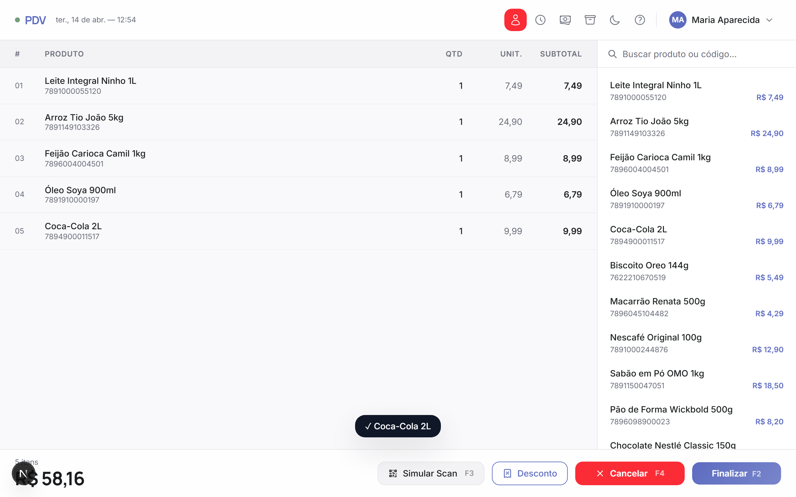
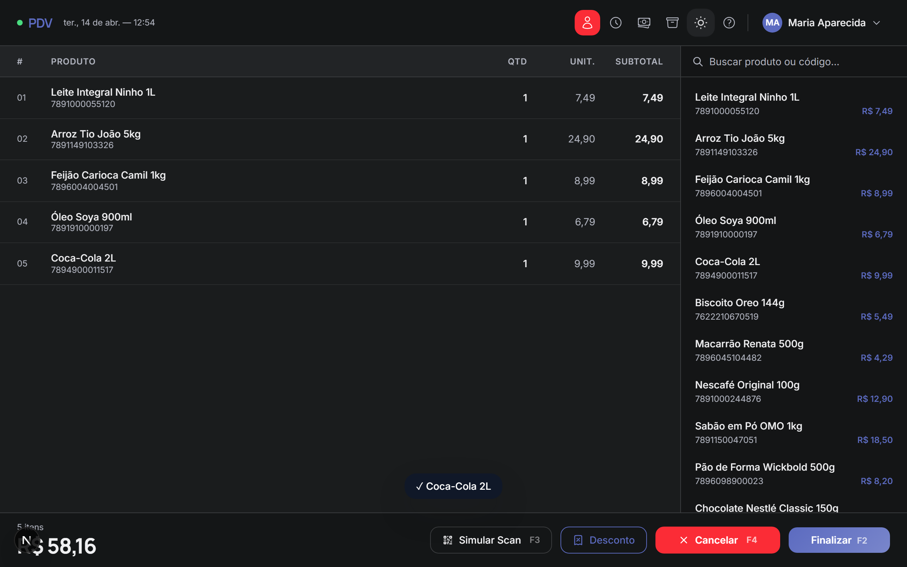
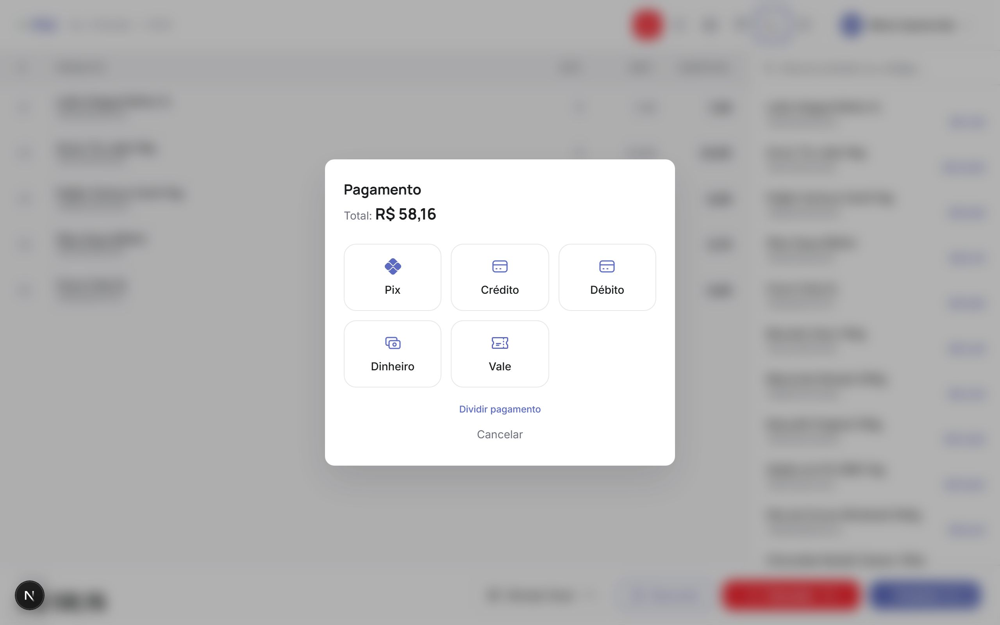
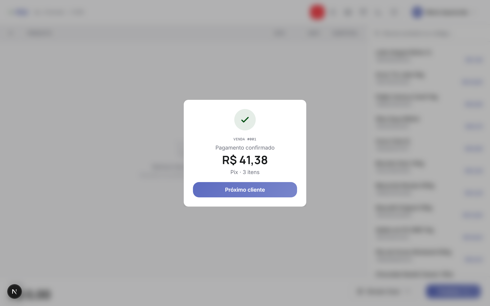
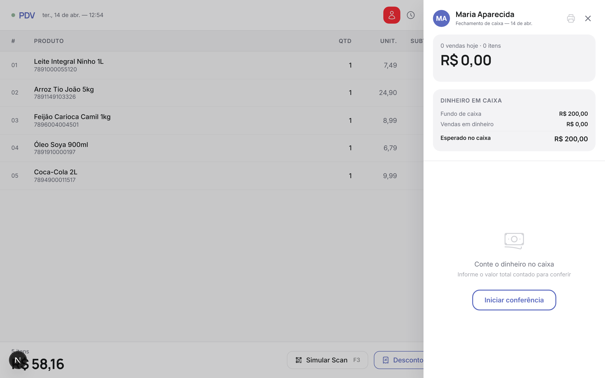
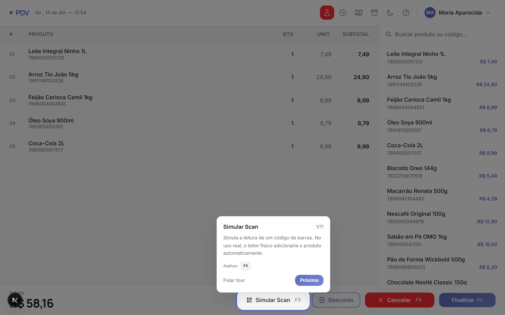

# Better PDV

Um sistema de PDV (Point of Sale) construído como **case de portfólio** focado em UX de produto — não apenas "colocar tela bonita", mas modelar os fluxos reais que um operador de caixa encontra num turno de trabalho.

🔗 **Demo ao vivo:** [better-pdv.vercel.app](https://better-pdv.vercel.app)



---

## Por que um PDV?

PDV é um domínio com alta densidade de decisões de UX:

- **Velocidade importa**: o caixa escaneia 20 itens em menos de um minuto. Cada clique a mais é atrito real.
- **Erros são caros**: cobrar errado, dar troco errado, ou perder uma venda por travar o sistema tem custo imediato.
- **O operador raramente é "tech-savvy"**: a interface precisa ser óbvia sem treinamento formal.
- **Existem muitos fluxos de exceção**: estorno, desconto, split de pagamento, pesagem, troca de operador, fechamento de caixa.

Mostrar como cada um desses pontos foi resolvido diz mais sobre processo de design do que uma landing page genérica.

---

## Features

### Fluxo principal
- **Scan de código de barras** (simulado via F3 ou leitor físico — input aceita ambos)
- **Carrinho com context menu** (botão direito em cada item: alterar quantidade, ver preço unitário, remover)
- **Busca instantânea** por nome ou código — digitar o código completo e dar Enter adiciona direto
- **Total em tempo real** com contagem de itens

### Pagamento
- 5 métodos: **Pix, Crédito, Débito, Dinheiro, Vale**
- **Dinheiro**: calcula troco automaticamente com atalhos de cédulas (R$ 50, 100, 200)
- **Split de pagamento**: divide entre múltiplos métodos; se um dos métodos é dinheiro, entra no fluxo de troco para essa parcela
- **Desconto em reais ou %** aplicado antes do pagamento

### Operação
- **Múltiplos operadores** com PIN de 4 dígitos (teclado virtual ou físico)
- **Histórico de vendas** por operador, filtrável por dia/mês/ano
- **Estorno** de vendas anteriores direto do histórico
- **Fechamento de caixa**: gráfico de barras por método, dinheiro esperado vs. contado, detecção de sobra/falta
- **Gestão de produtos**: adicionar, editar, remover do catálogo

### UX e polimento
- **Dark mode** (reduz cansaço em turno noturno)
- **Tutorial interativo** guiado passo-a-passo, destacando cada elemento com overlay
- **Feedback sensorial**: flash verde/vermelho ao scan, beep, animação de recibo "imprimindo"
- **Skeletons** em telas pesadas (fechamento, histórico)
- **Atalhos de teclado**: F1 supervisor, F2 finalizar, F3 scan, F4 cancelar, F5 produtos, F6 fechamento, F8 trocar operador
- **A11y**: focus-visible, ARIA roles, navegação 100% por teclado

---

## Screenshots

| Tela principal — light | Tela principal — dark |
| :---: | :---: |
|  |  |

| Pagamento | Comprovante (com n° sequencial) |
| :---: | :---: |
|  |  |

| Fechamento de caixa | Tutorial interativo |
| :---: | :---: |
|  |  |

---

## Stack

| | |
| --- | --- |
| Framework | **Next.js 16** (App Router, static export) |
| UI | **React 19** + **Tailwind CSS 4** |
| Linguagem | **TypeScript** (strict) |
| Deploy | **Vercel** (auto-deploy via GitHub) |
| Estado | React hooks puros — sem Redux/Zustand (escopo não justifica) |

Sem backend: tudo roda client-side. Propositalmente — o objetivo é demonstrar UX, não CRUD.

---

## Decisões de design

### Por que não Redux/Zustand?
O estado do PDV é essencialmente local à sessão (carrinho, operador atual, modais). `useState` + `useCallback` resolvem com menos boilerplate. Se houvesse sync com backend ou multi-tab, a decisão mudaria.

### Por que Tailwind 4 sem biblioteca de componentes?
Cada componente do PDV (modal de pagamento, drawer de histórico, context menu) tem comportamento específico demais pra caber em shadcn/MUI sem customização pesada. Escrevi do zero pra ter controle total sobre animação, foco e acessibilidade.

### Por que static export?
O app não tem API routes nem SSR dinâmico — é uma SPA sofisticada. Static export dá cold-start zero na Vercel e permite hospedar em qualquer CDN (S3, Cloudflare Pages, GitHub Pages).

### Animações com CSS, não Framer Motion
Keyframes + `transition` cobrem 100% das animações (flash de scan, print de recibo, stagger de entrada, drawer slide, modal scale). Framer Motion seria 60KB+ pra economizar pouca linha de código.

---

## Rodando localmente

```bash
git clone https://github.com/pedrocirinoo/better-pdv
cd better-pdv
npm install
npm run dev
```

Abre [localhost:3000](http://localhost:3000).

### Build de produção

```bash
npm run build
npm run start
```

### Regerar screenshots

```bash
npx playwright install chromium
npm run dev  # em outro terminal
node scripts/capture.mjs
```

---

## Roadmap

- [ ] Persistência em localStorage (operadores, histórico, produtos)
- [ ] Layout mobile (hoje é otimizado para tablet/desktop)
- [ ] PWA com modo offline real
- [ ] Exportar fechamento como PDF

---

## Licença

MIT 
